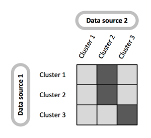

<!-- README.md is generated from README.Rmd. Please edit that file -->
Clusternomics
=============

Integrative clustering for heterogeneous datasets.

Introduction
------------

The goal of context-dependendent clustering is to identify clusters in a set of related datasets. Clusternomics identifies both local clusters that exist at the level of individual datasets, and global clusters that appear across the datasets.

A typical application of the method is the task of cancer subtyping, where we analyse tumour samples. The individual datasets (contexts) are then various features of the tumour samples, such as gene expression data, DNA methylation measurements, miRNA expression etc. The assumption is that we have several measurements of different types describing the same set tumours. Each of the measurements then describes the tumour in a different *context*.

The `clusternomics` algorithm identifies

-   clusters of measurements within individual datasets, we call these **local clusters**
-   clusters of tumour samples that are informed by the local clusters, these are **global clusters**

The following diagram illustrates the distinction. When we look at the data sets individually, context 1 contains three clusters and context 2 contains two clusters. These clusters correspond to the local clusters in the `clusternomics` package. On the global level, there are three distinct clusters that are only revealed when we look at the combination of local assignments within individual datasets.

Installation
------------

Use the `devtools` package to get the current version of the package:

    devtools::install_github("evelinag/clusternomics")

Using clusternomics
-------------------

See the package vignette for usage on a simulated dataset.

Datasets
--------

The package was tested using datasets originally downloaded from TCGA.

-   [Breast cancer](https://s3-eu-west-1.amazonaws.com/eg-cu/tcga/Breast-TCGA.zip)
-   [Kidney cancer](https://s3-eu-west-1.amazonaws.com/eg-cu/tcga/Kidney.zip)
-   [Lung cancer](https://s3-eu-west-1.amazonaws.com/eg-cu/tcga/Lung.zip)
